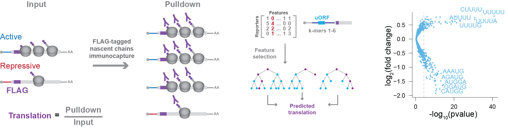

# NaP-TRAP Reveals the Regulatory Grammar in 5'UTR-Mediated Translation Regulation During Zebrafish Development

This repository details the analyses presented in "_NaP-TRAP Reveals the Regulatory Grammar in 5'UTR-Mediated Translation Regulation During Zebrafish Development_" (https://doi.org/10.1101/2023.11.09.566434).